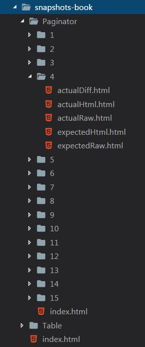

# Jest-snapshots-book

Custom [jest](https://jestjs.io/) reporter that builds html representations of snapshots. 

Each time when jest is run this reporter will produce a book of snapshots with table of contents. The book will be placed in the folder "snapshots-book" in the root of your project. 



You can check up your snapshots in the browser instead of manually listing them in a code editor. For React components all styles (including those from css-modules) will be applied, so that you can see styled components in your browser.

Here is an example of snapshots for paginator React component. Clicking on the snapshot toggles its representation: rendered - raw - diff.


# Usage

Install as a dev dependency
```
$ npm install --save-dev jest-snapshots-book
```

Add reporter after the default jest reporter in jest configuration file:
```
"reporters": [
    "default",
    "jest-snapshots-book"
]
```

Add the reporter directory to ignored paths:
```
"modulePathIgnorePatterns": [
    "<rootDir>/snapshots-book"
],
"watchPathIgnorePatterns": [
    "<rootDir>/snapshots-book"
]
```

To enable verbose mode of the reporter pass "verbose": true as additional parameter when initializing the reporter:
```
"reporters": [
    "default",
    ["jest-snapshots-book", {"verbose": true}]
]
```   