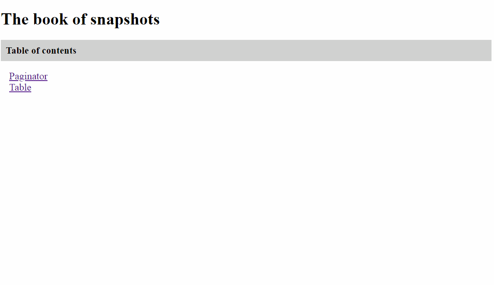

# Jest-snapshots-book

Jest-snapshots-book is a custom [jest](https://jestjs.io/) reporter that builds html representations of snapshots. It is designed for snapshot testing React components.

Jest-snapshots-book reporter recursively goes through the tested component and all its' parents and grabs all styles. Grabbed styles are inserted in the component page so that you can see styled React component there. 

The reporter takes raw **expected** snapshot content from a component .snap file. Then it makes the **actual** snapshot by applying diff from a failed test result to the expected snapshot.

Each time when jest is run this reporter will produce a book of snapshots with table of contents. The book will be placed in the folder "snapshots-book" in the root of your project.


You can check out your snapshots in the browser instead of manually listing them in your code editor.

Here is an example of a test file for a paginator React component:

```jsx
import React from 'react';

import { configure, render } from 'enzyme';
import Adapter from 'enzyme-adapter-react-16';

import Paginator from './Paginator';

configure({ adapter: new Adapter() });

describe('Paginator', () => {
    const snapshoot = (tp, cp) => {
        const wrapper = render(<Paginator tp={tp} cp={cp} />);
        it(`Total = ${tp}, Current = ${cp}`, () => {
            expect(wrapper).toMatchSnapshot();
        });
    }

    snapshoot(0, 0);
    snapshoot(1, -1);
    snapshoot(1, 1);
    snapshoot(2, 2);
    snapshoot(3, 1);

    for (let cp = 1; cp <= 10; cp++) {
        snapshoot(10, cp);
    }
});
```

Here is the result produced by jest-snapshots-book reporter. If a test passed only one snapshot is shown because expected and actual snapshots are the same. If a test failed expected and actual snapshots are shown side by side. Clicking on the snapshot toggles its' representation (rendered, raw, diff).



# Usage

Install as a dev dependency:
```
$ npm install --save-dev jest-snapshots-book
```

Add the reporter after the default jest reporter in the configuration file:
```
"reporters": [
    "default",
    "jest-snapshots-book"
]
```

Add the reporter directory to ignored paths:
```
"modulePathIgnorePatterns": [
    "<rootDir>/snapshots-book"
],
"watchPathIgnorePatterns": [
    "<rootDir>/snapshots-book"
]
```

To enable verbose mode of the reporter pass `"verbose": true` as an additional parameter when initializing the reporter:
```
"reporters": [
    "default",
    ["jest-snapshots-book", {"verbose": true}]
]
```